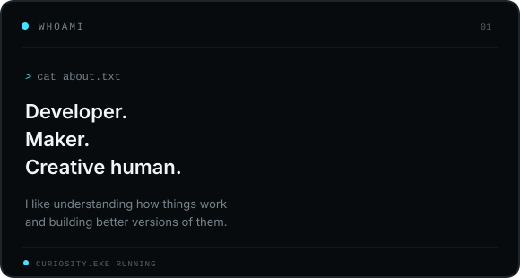
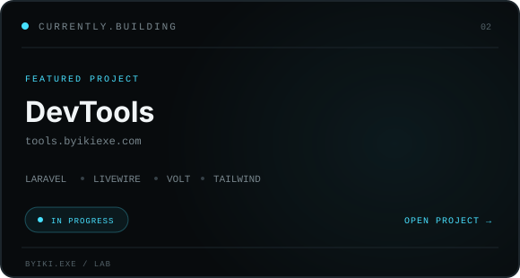
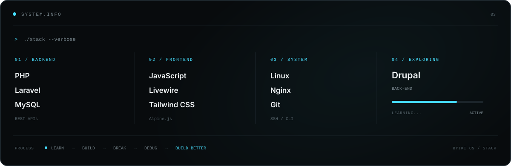
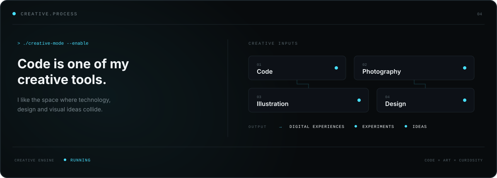
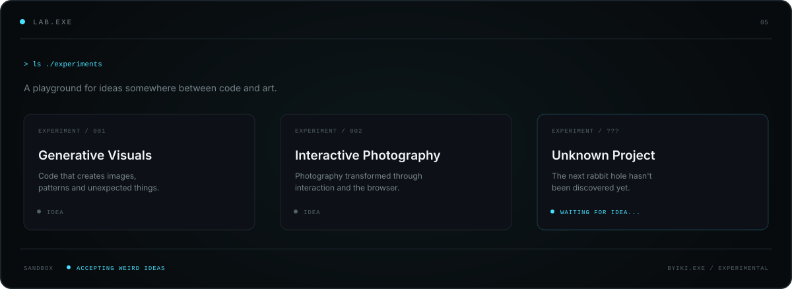
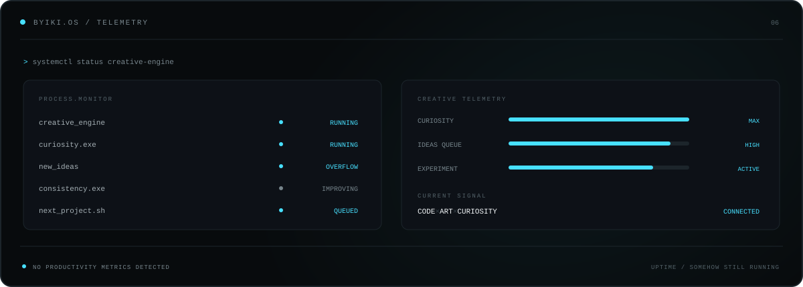

  

 

  
  

 

  

 

  

 

  

 

  

 

  

  <a href="http://byikiexe.com/">WEB</a>
  &nbsp;&nbsp;·&nbsp;&nbsp;
  <a href="https://www.linkedin.com/in/victoria-nunez-oliveira">LINKEDIN</a>
  &nbsp;&nbsp;·&nbsp;&nbsp;
  <a href="https://www.instagram.com/byiki.exe/">INSTAGRAM</a>

